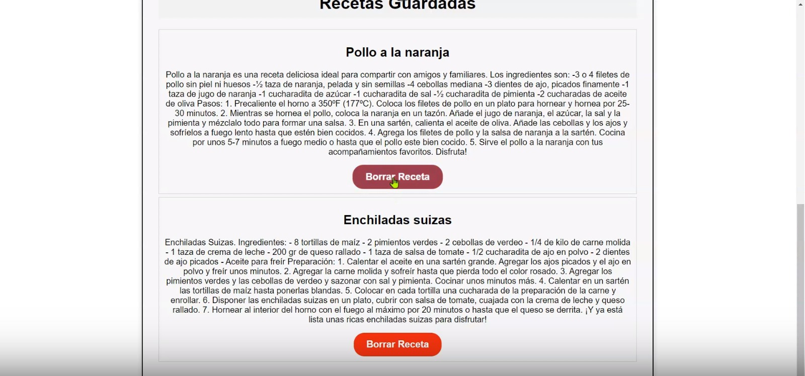
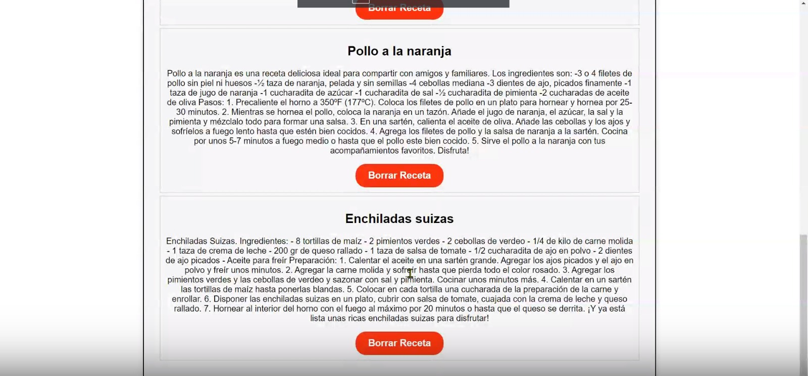
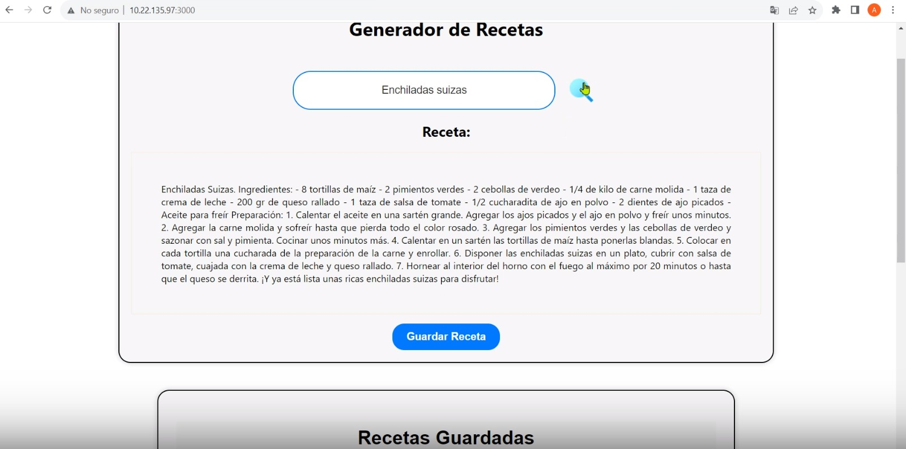

# Proyecto para el HackMTY Hackathon

**Fecha del Hackathon:** 23 y 24 de septiembre de 2023

**Lugar:** Tec de Monterrey, Monterrey, NL
## 2023 Sponsors

- Chubb
- Softtek
- Banorte
- NDS Cognitive Labs
- Reservamos
- Google
- Constellation Brands

For more information about sponsorship opportunities, please send an email to sponsors@hackmty.com.

## Partners

- MLH (Major League Hacking)
## Sobre Nuestro Proyecto

Bienvenido a la descripción de nuestro emocionante proyecto para el HackMTY Hackathon. Aquí te proporcionamos una visión general de lo que hemos creado y cómo puede marcar la diferencia.

### Descripción del Proyecto

Nuestro proyecto se llama "RecipeIA", y se trata de una innovadora aplicación que ayuda a las personas a encontrar recetas de cocina deliciosas y fáciles de preparar en cuestión de minutos. Con la vida tan ocupada que llevamos, a menudo es difícil encontrar tiempo para cocinar comidas caseras saludables. RecetaRápida resuelve este problema al proporcionar una amplia gama de recetas rápidas y deliciosas que cualquiera puede preparar, incluso si no son chefs expertos.

## Escalabilidad y Futuro del Proyecto

**RecipeIA** está diseñado para crecer y mejorar con el tiempo. A medida que avanzamos en el desarrollo de la aplicación, tenemos en mente varias áreas de mejora y expansión:

### Personalización Avanzada

En el futuro, planeamos implementar un sistema de personalización más avanzado. Esto permitirá que cada usuario tenga una experiencia única en la aplicación. Al analizar las preferencias y hábitos de cocina de cada persona, **RecipeIA** podrá sugerir recetas aún más personalizadas. También consideramos la posibilidad de tener perfiles de usuario para que puedas guardar tus recetas favoritas y ajustar las preferencias de forma más detallada.

### Ampliación del Menú

Nuestra visión es proporcionar una amplia variedad de menús y opciones culinarias. Además de recetas rápidas, planeamos agregar menús para dietas específicas, como vegetarianas, veganas, bajas en carbohidratos, entre otras. También queremos ofrecer menús para ocasiones especiales, como cenas románticas, comidas familiares y fiestas.

### Convenios con Supermercados y Plataformas de Entrega

Para facilitar aún más la experiencia del usuario, estamos explorando la posibilidad de establecer convenios con supermercados locales y en línea. Una característica futura de **RecipeIA** podría ser la integración directa con supermercados, donde, a partir de las recetas seleccionadas, la aplicación generará automáticamente una lista de ingredientes para su compra. Incluso podríamos ofrecer recomendaciones sobre las mejores ofertas y opciones de ingredientes de alta calidad. Además, estamos investigando la integración con plataformas de entrega para que puedas ordenar los ingredientes directamente a tu casa con un solo clic.

### Incorporación de IA Avanzada

Como lo indica nuestro nombre "RecipeIA," planeamos utilizar la inteligencia artificial de manera más avanzada. Esto incluye la implementación de algoritmos de aprendizaje automático para comprender mejor las preferencias del usuario y ofrecer sugerencias más precisas. También estamos investigando cómo la IA puede ayudar en la detección de alergias alimentarias y restricciones dietéticas.

### Comunidad de Cocineros y Compartir Recetas

Queremos fomentar la interacción entre los usuarios y crear una comunidad de amantes de la cocina. En el futuro, podrás compartir tus propias recetas, consejos culinarios y trucos con otros miembros de la comunidad. Además, estamos considerando la posibilidad de organizar desafíos culinarios y eventos especiales en la aplicación.

**RecipeIA** está en constante evolución, y nuestro objetivo es convertirlo en la herramienta definitiva para todos los entusiastas de la cocina, desde principiantes hasta chefs experimentados. ¡Esperamos que te unas a nosotros en este emocionante viaje culinario!

Con estos planes de escalabilidad, **RecipeIA** está listo para crecer y adaptarse a las necesidades cambiantes de nuestros usuarios. Estamos comprometidos a brindar una experiencia culinaria excepcional y hacer que cocinar en casa sea más fácil y emocionante que nunca.

## Capturas de Pantalla

A continuación, te mostramos algunas capturas de pantalla de nuestro proyecto:

## Cómo Contribuir

¡Estamos emocionados de recibir contribuciones de la comunidad! Si deseas contribuir a nuestro proyecto, sigue estos pasos:

1. Haz un fork de este repositorio.

2. Clona el repositorio a tu máquina local.

3. Crea una nueva rama para tu contribución: `git checkout -b mi-contribucion`.

4. Realiza los cambios necesarios y realiza commits: `git commit -m 'Agrega mi contribución'`.

5. Sube los cambios a tu fork: `git push origin mi-contribucion`.

6. Crea un pull request en este repositorio.

Estaremos revisando tus contribuciones y fusionándolas con el proyecto principal. ¡Gracias por tu interés en ayudar!

## Contacto

Si tienes preguntas o comentarios sobre nuestro proyecto, no dudes en ponerte en contacto con nosotros:

- [Correo Electrónico](arellanosantoso6@gmail.com)

## Agradecimientos

Queremos expresar nuestro agradecimiento a los organizadores del HackMTY Hackathon por brindarnos esta oportunidad y a nuestros mentores por su valiosa orientación.

¡Esperamos que disfrutes explorando RecetaRápida y que te sea útil en tu vida cotidiana!

---

## Getting Started with Create React App

Este proyecto se inició con [Create React App](https://github.com/facebook/create-react-app).

### Scripts Disponibles

En el directorio del proyecto, puedes ejecutar:

#### `npm start`

Ejecuta la aplicación en modo de desarrollo.\
Abre [http://localhost:3000](http://localhost:3000) para verla en tu navegador.

La página se recargará cuando realices cambios.\
También puedes ver cualquier error de lint en la consola.

#### `npm test`

Inicia el runner de pruebas en el modo interactivo de observación.\
Consulta la sección sobre [cómo ejecutar pruebas](https://facebook.github.io/create-react-app/docs/running-tests) para obtener más información.

#### `npm run build`

Compila la aplicación para producción en la carpeta `build`.\
Empaqueta React en modo de producción y optimiza la compilación para obtener el mejor rendimiento.

La compilación se minimiza y los nombres de archivo incluyen los hashes.\
¡Tu aplicación está lista para implementarse!

Consulta la sección sobre [implementación](https://facebook.github.io/create-react-app/docs/deployment) para obtener más información.

#### `npm run eject`

**Nota: esta es una operación de un solo sentido. ¡Una vez que hagas `eject`, no puedes volver atrás!**

Si no estás satisfecho con la herramienta de compilación y las opciones de configuración, puedes hacer `eject` en cualquier momento. Este comando eliminará la dependencia de compilación única de tu proyecto.

En su lugar, copiará todos los archivos de configuración y las dependencias transitivas (Webpack, Babel, ESLint, etc.) directamente en tu proyecto para que tengas control total sobre ellos. Todos los comandos excepto `eject` seguirán funcionando, pero apuntarán a los scripts copiados para que puedas modificarlos. En este punto, estás por tu cuenta.

No tienes que usar `eject` nunca. El conjunto de características curado es adecuado para implementaciones pequeñas y medianas, y no debes sentirte obligado a usar esta característica. Sin embargo, entendemos que esta herramienta no sería útil si no pudieras personalizarla cuando estés listo para hacerlo.

## Más Información

Puedes obtener más información en la [documentación de Create React App](https://facebook.github.io/create-react-app/docs/getting-started).

Para aprender React, consulta la [documentación de React](https://reactjs.org/).

### División de Código

Esta sección se ha trasladado aquí: [https://facebook.github.io/create-react-app/docs/code-splitting](https://facebook.github.io/create-react-app/docs/code-splitting)

### Análisis del Tamaño del Paquete

Esta sección se ha trasladado aquí: [https://facebook.github.io/create-react-app/docs/analyzing-the-bundle-size](https://facebook.github.io/create-react-app/docs/analyzing-the-bundle-size)

### Creación de una Aplicación Web Progresiva

Esta sección se ha trasladado aquí: [https://facebook.github.io/create-react-app/docs/making-a-progressive-web-app](https://facebook.github.io/create-react-app/docs/making-a-progressive-web-app)

### Configuración Avanzada

Esta sección se ha trasladado aquí: [https://facebook.github.io/create-react-app/docs/advanced-configuration](https://facebook.github.io/create-react-app/docs/advanced-configuration)

### Implementación

Esta sección se ha trasladado aquí: [https://facebook.github.io/create-react-app/docs/deployment](https://facebook.github.io/create-react-app/docs/deployment)

### `npm run build` no se puede minimizar

Esta sección se ha trasladado aquí: [https://facebook.github.io/create-react-app/docs/troubleshooting#npm-run-build-fails-to-minify](https://facebook.github.io/create-react-app/docs/troubleshooting#npm-run-build-fails-to-minify)
